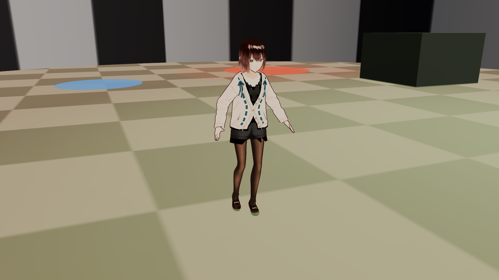

# fly-brain



## このリポジトリがやろうとしていること

**ハエの脳という、LLM とはまったく別の仕組みの知能を主体に置き、それが AI エージェントを使って何かを成し遂げられるかを確かめる実験です。** ふつうは AI エージェントが道具を使いますが、ここでは主従が逆で、ハエ脳が主体、AI エージェントが道具です。

土台は、キイロショウジョウバエ（雄）の中枢神経系の配線図（コネクトーム：16万5122個のニューロン、1億400万個のシナプス）をそのまま動かすスパイキングニューラルネットワークです。脳は物理シミュレーション（MuJoCo）のハエの体とつながっていて、複眼・触角・脚先の感覚を受け取り、下降ニューロンの発火で体を動かします。外から命令されることなく、空腹などの内的状態を持ち、行動を選び続けます。

### 原則：ハエには手を入れない

ハエの脳・体・行動の仕組みは元のモデルのままで、学習もしません。実験者が設計してよいのは**環境**（餌・匂い・端末の配置）と**インターフェース**（脳の読み取り方、エージェントの行動がハエに返る経路、見た目）だけです。高速化などでコードに手を入れるときは、ハエの出力がビット単位で変わらないことを `scripts/golden_trace.mjs` で確かめています。

### これまでの結果：ハエ脳は AI エージェントを動かせた

ハエの脳活動を読み取る、読み取り専用のブレイン・コンピュータ・インターフェース（BCI）を作りました。現実でいえば、歩き回るハエの全脳活動を記録してデコードし、その出力でハエの周りを変える装置を動かす形です。AI エージェント（ローカル LLM）が受け取るのは、脳から読み取った状態表（空腹・匂い・視界など）だけで、位置も地図も見えません。

| エージェントが読んだ脳 | ハエが本当に強い空腹のとき砂糖を置いた | それ以外のとき置いた |
|---|---|---|
| そのハエ自身の脳 | 49% | 11%（p = 0.0001） |
| 別のハエの脳（対照） | 26% | 32%（p = 0.63） |

学習も改変もしていないハエの脳状態が、エージェントの行動をハエの必要に沿う方向へ動かしました。一方、ハエがそれで得をした（多く食べた）という差はまだ出ていません。詳細と注意点は [BCI 実験レポート](docs/20260928-bci-experiment-report.md) にあります。

### 見る・動かす

```
npm install && npm run dev      # http://localhost:5173/arena.html?avatar=vrm&env=agents
npm run bridge                  # 別のターミナルで。エージェント連携と「脳の声」に必要（Ollama が要る）
```

- **人型アバター**（`?avatar=vrm`）：ハエ脳の動きに合わせて、人型キャラ（VRoid AvatarSample_A）が歩きます。ハエが飛んでも跳んでも、アバターは床の上を歩いて見せます。
- **脳の声**：ハエの脳の状態が変わると、LLM がそれを一人称の日本語にしてしゃべります。脳には何も書き込みません。
- **エージェント連携**：端末に触れる、または BCI（`?bci=1`）で、Ollama・Claude Code・Codex がアリーナに砂糖や匂いを置きます。中継サーバ（`bridge-server/`）は localhost 限定で、エージェントの権限を最小にしています。
- **実験**：`node scripts/experiment_bci.mjs`（BCI）、`node scripts/experiment_baseline.mjs`（端末）。

設計は [docs/20260927-fly-brain-humanoid-agent-design.md](docs/20260927-fly-brain-humanoid-agent-design.md) にあります。

以下は、土台になっているシミュレーター（[Lulzx/fly-brain](https://github.com/Lulzx/fly-brain)）の説明です。

---

The complete wiring diagram of a male fruit fly's nervous system is now a file: 165,122
neurons, 104 million synapses. This project runs that file as a spiking brain, inside a
physics-simulated body, in a web browser, and then asks a simple question: which of the
fly's behaviours does the wiring produce on its own, and which had to be added from
outside the graph? The second list turned out to be as interesting as the first.

**Try it:** [arena](https://lulzx.com/fly-brain/arena.html) ·
[connectome viewer](https://lulzx.com/fly-brain/) ·
[algorithmic structures](https://lulzx.com/fly-brain/structures.html) ·
[the textbook](https://lulzx.com/fly-brain/textbook/)
(desktop Chrome, Edge or Firefox; the viewer downloads about 30 MB, the arena about 23 MB)

## Start here

- [What this is](docs/guide/what-this-is.md). One fly is a 165,122-neuron connectome brain
  in a MuJoCo body with a trained compound eye. What the pieces are and why each one is there.
- [Run it](docs/guide/run.md). Two commands to get the arena running locally, and what the
  browser actually loads.
- [The four apps](docs/guide/apps.md). The connectome viewer, the structures page, the arena,
  and the 3D fly.

## How it works

- [What happens every simulated millisecond](docs/guide/loop.md). Senses, brain, motor,
  physics, endogenous behaviour, neuromodulation, courtship, flight. Each stage in a
  paragraph, with the file that implements it.
- [What the wiring gives you, and what it does not](docs/guide/what-the-wiring-gives.md).
  The honest boundary: which behaviours are read out of the connectome and which are
  supplied by code around it.
- [Building the data](docs/guide/pipeline.md). From the raw 10 GB of Janelia tables to the
  27 MB the browser loads, and the calibration and gait fits on top.
- [Headless experiments](docs/guide/experiments.md). Running flies in Node without a browser,
  and the behavioural benchmark suite.

## Going deeper

- [Full documentation index](docs/README.md). Thirty-five documents covering every subsystem,
  the calibration, the limitations and the roadmap.
- [Compiling the Fly Brain](docs/textbook/) is a research monograph on candidate
  computations, connectome-constrained model families, and experiments that distinguish
  them. It separates established biology, recorded model results, and open predictions.
  [Read online](https://lulzx.com/fly-brain/textbook/) or
  [download the PDF](public/fly-brain-textbook.pdf). Executable instructions live in the
  [technical reproduction companion](docs/textbook-reproduction.md).
- [Sources and credits](docs/guide/sources.md). The connectome, the body, the eye, the
  walking data, and the licences.

## Layout

| path | contents |
|---|---|
| `index.html`, `src/main.js` | connectome viewer |
| `arena.html`, `src/arena.js` | embodied arena |
| `structures.html`, `src/structures.js` | algorithmic-structure visualisation |
| `textbook/`, `src/textbook.js` | ebook reader for `docs/textbook/` |
| `src/sim/` | fly agent, world, senses, vision, motor, endogenous behaviour, neuromodulation, flight, worker |
| `src/lif.js`, `src/lifwasm.js`, `src/lifgpu.js`, `src/wasm/lif.c` | brain model in JavaScript, WebAssembly and WebGPU |
| `src/brainmodel.js`, `src/brainsetup.js` | calibrated brain construction, shared memory |
| `connectome.bend`, `dataset.bend`, `LAWS.bend`, `PROOF.bend`, `malecns.bend` | the compiler and the male connectome formalized in Bend: laws, proofs, and a run over the real tables |
| `cord.bend`, `kernel.bend`, `perturb.bend`, `cord*.bend` | the nerve cord in Bend: a checked subgraph, a bit-identical spiking kernel, proven perturbations, and the ensemble |
| `src/flyvis.js` | flyvis optic-lobe runtime |
| `public/` | preprocessed data served to the browser |
| `scripts/` | preprocessing, calibration, optimisation, analysis, tests |
| `docs/` | documentation, the guide, and the textbook source |
